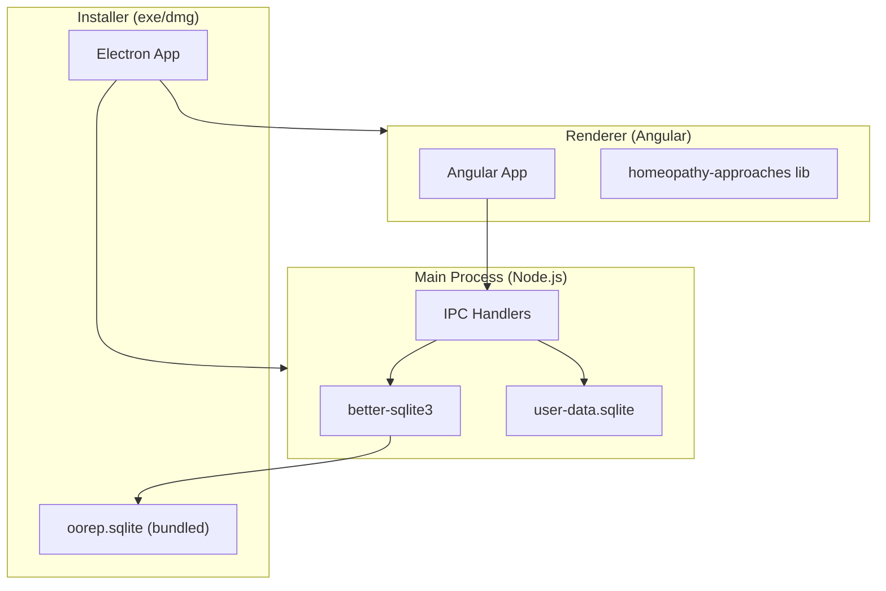

# Offline Homeopathy Desktop App

## Tech Stack

| Layer         | Technology                                     | Rationale                                                                                        |
| ------------- | ---------------------------------------------- | ------------------------------------------------------------------------------------------------ |
| Desktop shell | **Electron 33+**                               | Reuses existing Angular components; mature ecosystem for Win+Mac; native file dialogs for export |
| Frontend      | **Angular 19** (same as doctor-web)            | Direct code reuse of all panels, approach workflows, and UI                                      |
| Embedded DB   | **better-sqlite3** (via Electron main process) | Synchronous, fast, handles 1.36M rows easily; no server needed                                   |
| Shared logic  | `@hopehub/homeopathy-approaches`               | Pure TS library — all 27 approaches, case sheets, protocol catalogs, prescription handoff        |
| Data bundle   | **Pre-built SQLite .db file** (~80-120MB)      | Converted once from OOREP PostgreSQL dump; ships with installer                                  |
| Packaging     | **electron-builder**                           | Produces `.exe` (NSIS) for Windows, `.dmg` for macOS                                             |
| IPC           | Electron contextBridge + preload               | Secure bridge between renderer (Angular) and main (SQLite)                                       |

## Architecture



**Two SQLite databases:**

1. **`oorep.sqlite`** (read-only, bundled) — 143K rubrics, 2.4K remedies, 1.36M links, 6.4K MM sections
2. **`user-data.sqlite`** (read-write, in user's app data folder) — case analyses, selected remedies, prescriptions, notes, preferences

## Data Conversion Pipeline

A one-time build script converts the OOREP PostgreSQL dump into SQLite:

1. Parse `oorep.sql.gz` (already downloaded)
2. Create SQLite schema mirroring `repertory.prisma` models: `repertory_source`, `remedy`, `rubric`, `rubric_remedy`, `mm_source`, `mm_section`
3. Insert all rows with proper indexes (`normalizedText`, `chapter+sourceId`, `remedyId`)
4. Produce `oorep.sqlite` (~80-120MB with FTS5 virtual table for rubric search)
5. This file is committed to the desktop app's `resources/` or downloaded at first-run

## Feature Mapping (Web to Desktop)

| Web Feature                    | Desktop Equivalent                                                                    |
| ------------------------------ | ------------------------------------------------------------------------------------- |
| API repertory search           | SQLite FTS5 full-text search on `rubric.normalizedText`                               |
| API repertorize endpoint       | Local `computeRepertorization()` — same grade\*weight algorithm, runs in main process |
| API materia medica endpoint    | Direct SQLite query on `mm_section` table                                             |
| API case analysis CRUD         | Local SQLite insert/update in `user-data.sqlite`                                      |
| HTTP auth + doctor context     | Removed — single-user, no auth needed                                                 |
| Prescription options / methods | Bundled from `APPROACH_DEFINITIONS` (no DB sync needed)                               |
| Clinical media upload          | Local file storage in app data folder                                                 |

## Key Code Reuse

These existing files port directly (or with minimal changes):

- **`libs/homeopathy-approaches/src/*`** — entire library (27 approaches, workflows, case sheets, protocols, handoff)
- **`apps/doctor-web/src/app/features/case-analysis/panels/*`** — all UI panels
- **`apps/doctor-web/src/app/features/repertory-browser/*`** — the browser page we just built
- **`apps/api/src/services/repertorization.ts`** — `computeRepertorization()` algorithm
- **`apps/api/src/services/repertory-search.ts`** — `tokenizeRepertoryQuery()`, `scoreRubricMatch()` (adapted from Prisma to raw SQL)

## Project Structure

```
apps/desktop/
  ├── electron/
  │   ├── main.ts              (Electron main entry)
  │   ├── preload.ts           (contextBridge API)
  │   ├── ipc/
  │   │   ├── repertory.ipc.ts (rubric search, chapters, MM queries)
  │   │   ├── case.ipc.ts      (case analysis CRUD, repertorize)
  │   │   └── export.ipc.ts    (PDF prescription export)
  │   ├── db/
  │   │   ├── oorep.db.ts      (read-only connection to bundled data)
  │   │   └── user.db.ts       (read-write user data)
  │   └── services/
  │       └── repertorization.ts (ported from API)
  ├── src/                     (Angular app — forked from doctor-web)
  │   ├── app/
  │   │   ├── features/        (case-analysis, repertory-browser, etc.)
  │   │   ├── core/services/
  │   │   │   └── desktop-api.service.ts (replaces HTTP with IPC calls)
  │   │   └── ...
  │   └── environments/
  ├── scripts/
  │   └── convert-oorep-to-sqlite.ts
  ├── resources/
  │   └── oorep.sqlite         (bundled data — gitignored, built by script)
  ├── angular.json
  ├── electron-builder.yml
  └── package.json
```

## IPC API (replaces HTTP)

The Angular renderer calls the main process via a typed bridge:

```typescript
// preload.ts exposes:
window.desktopApi = {
  repertory: {
    searchRubrics(q, sourceId?, limit?): Promise<RubricResult[]>,
    suggestRubrics(q, sourceId?): Promise<RubricSuggestion[]>,
    getChapters(sourceId): Promise<ChapterEntry[]>,
    getChapterRubrics(sourceId, chapter, limit?, offset?): Promise<RubricResult[]>,
    searchRemedies(q, limit?): Promise<RemedyRef[]>,
    getMateriaMedica(remedyId): Promise<MateriaMedicaResponse>,
    getSources(): Promise<RepertorySource[]>,
  },
  caseAnalysis: {
    list(): Promise<CaseAnalysis[]>,
    create(data): Promise<CaseAnalysis>,
    update(id, patch): Promise<CaseAnalysis>,
    delete(id): Promise<void>,
    repertorize(id): Promise<RepertorizationResult>,
    selectRemedy(id, remedyId): Promise<void>,
  },
  prescription: {
    generate(analysisId): Promise<PrescriptionData>,
    exportPdf(data): Promise<string>, // returns file path
  }
};
```

## Build & Distribution

- **Windows:** NSIS installer (~120-150MB), auto-updater optional
- **macOS:** DMG with universal binary (arm64 + x64)
- **First run:** no setup needed — SQLite data is bundled in `resources/`
- **Updates:** electron-builder auto-update via GitHub Releases (optional; app works fully offline)

## Offline Capabilities Summary

- Full 143K rubric repertory search with FTS5 (sub-50ms)
- Browse all chapters hierarchically
- Full materia medica for 2,432 remedies (Boericke)
- All 27 homeopathic approaches with structured panels
- Repertorization with approach-specific weight boosts
- Case sheets, notes, and case history (stored locally)
- Prescription generation and PDF export
- No login, no internet, no database server
