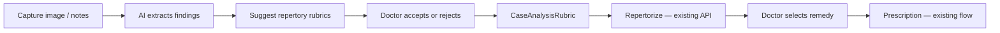
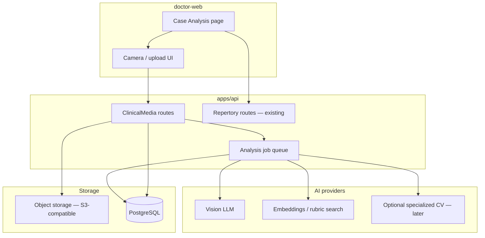

# Case Analysis — AI Enrichment Plan

This document describes how to extend Vitalis **Case Analysis** (homeopathic repertorization in `doctor-web`) with image upload, camera capture, and AI-assisted symptom detection. It is a product and engineering plan — not a commitment to auto-prescribe or auto-diagnose.

**Related code today:**

| Area | Location |
|------|----------|
| Case Analysis UI | `apps/doctor-web/src/app/features/case-analysis/` |
| Repertory API | `apps/api/src/routes/repertory/` |
| Repertory schema | `apps/api/prisma/schema/repertory.prisma` |
| OOREP data import | `apps/api/scripts/import-oorep-sql.ts`, `apps/api/data/oorep/` |
| Consultations | `apps/api/prisma/schema/clinical.prisma` |

---

## Guiding principle

**AI suggests rubrics and observations. The doctor always confirms. AI never selects the remedy.**

Homeopathy is holistic: mentals, modalities, constitution, timeline, and context matter as much as appearance. The correct product shape is **AI-assisted case building** that feeds the existing repertorization pipeline — not a black-box diagnosis engine.



---

## What AI can and cannot do

| Input | Strong fit | Weak fit |
|-------|------------|----------|
| Photo (skin, tongue, nails, rash, swelling) | Objective visual signs → rubric keywords | Totality, mentals, causation |
| Live camera | Guided capture, quality checks | Continuous real-time “diagnosis” |
| Doctor notes / voice | NLP → rubric phrase suggestions | Replacing clinical judgment |
| Patient questionnaire | Structured symptoms → rubrics | Rare or idiosyncratic expressions |
| Vitals / wearables (later) | Objective trends | Direct remedy mapping |

**Avoid early:**

- Auto remedy selection
- Primary output as disease labels (“eczema”, “psoriasis”) instead of repertory language
- Single-image remedy prediction
- Image storage without consent and retention policy
- Opaque suggestions without evidence or confidence

---

## Product modes

### Mode A — Guided symptom capture (Phase 0–1)

Doctor or patient attaches images to a **symptom slot** on a case analysis:

- Rash (location, spread, color)
- Tongue (coating, cracks, color) — assistive only; strong disclaimers
- Nails, hair, swelling, lesions

Each attachment includes:

- Symptom type and body region
- Onset and change over time
- Patient-reported sensation (burning, itching, etc.)
- Doctor confirmation

**AI output:** observation bullets and repertory search phrases — not prescriptions.

Example:

> Erythematous papular eruption on extensor surfaces. Suggested search: `skin eruptions papular`, `skin redness`.

### Mode B — Camera assist (Phase 2–3)

In `doctor-web` case analysis:

- Wizards: “Capture tongue”, “Capture skin lesion”
- Client checks: blur, exposure, distance
- Optional ROI crop before upload
- Side-by-side: image | AI findings | suggested rubrics

Use **structured capture sessions**, not always-on scanning.

### Mode C — Multimodal case assistant (Phase 4–5)

Combine images, analysis notes, selected rubrics, and consultation history.

**AI output:**

- Missing symptom domains (mind, generals, modalities)
- Ranked rubric suggestions with short rationale
- Conflict hints (contradictory rubrics)

Doctor taps **Add to case** → existing `CaseAnalysisRubric` → `POST .../repertorize`.

### Mode D — Specialized auto-detection (Phase 4+, narrow scope)

Automate only where computer vision is mature:

| Detector | Role in workflow |
|----------|------------------|
| Skin lesion / morphology | Suggest dermatology-style rubrics |
| Tongue segmentation + features | Suggest tongue/coating rubrics (assistive) |
| Nail / hair patterns | Secondary support only |

Map detector labels to rubrics via a **manual ontology table** — not directly to remedy names.

---

## Target architecture



### Proposed data model (new)

Add to Prisma (likely `clinical.prisma` or `repertory.prisma`):

```prisma
enum ClinicalMediaType {
  SKIN
  TONGUE
  NAIL
  HAIR
  SWELLING
  OTHER
}

enum RubricSuggestionStatus {
  PENDING
  ACCEPTED
  REJECTED
}

model ClinicalMedia {
  id              String            @id @default(cuid())
  consultationId  String
  caseAnalysisId  String?
  uploadedById    String
  mediaType       ClinicalMediaType
  bodyRegion      String?
  storageKey      String
  mimeType        String
  caption         String?
  patientConsent  Boolean           @default(false)
  consultation    Consultation      @relation(...)
  caseAnalysis    CaseAnalysis?     @relation(...)
  analyses        MediaAnalysis[]
  createdAt       DateTime          @default(now())
}

model MediaAnalysis {
  id              String          @id @default(cuid())
  mediaId         String
  modelId         String
  modelVersion    String
  observations    Json            // structured findings
  rawResponse     Json?
  status          String          // COMPLETED | FAILED
  media           ClinicalMedia   @relation(...)
  suggestions     RubricSuggestion[]
  createdAt       DateTime        @default(now())
}

model RubricSuggestion {
  id              String                 @id @default(cuid())
  analysisId      String
  caseAnalysisId  String
  rubricId        String?
  searchPhrase    String
  confidence      Float?
  rationale       String?
  status          RubricSuggestionStatus @default(PENDING)
  reviewedById    String?
  reviewedAt      DateTime?
  analysis        MediaAnalysis          @relation(...)
  caseAnalysis    CaseAnalysis           @relation(...)
  rubric          RepertoryRubric?       @relation(...)
}
```

**Audit requirements:** store model ID/version, prompt version, who accepted/rejected each suggestion, and timestamps.

---

## API surface (planned)

| Method | Path | Purpose |
|--------|------|---------|
| `POST` | `/doctor/case-analyses/:id/media` | Upload image (multipart) |
| `GET` | `/doctor/case-analyses/:id/media` | List attachments |
| `DELETE` | `/doctor/case-analyses/:id/media/:mediaId` | Remove attachment |
| `POST` | `/doctor/case-analyses/:id/media/:mediaId/analyze` | Queue AI analysis |
| `GET` | `/doctor/case-analyses/:id/suggestions` | Pending rubric suggestions |
| `PATCH` | `/doctor/case-analyses/:id/suggestions/:suggestionId` | Accept / reject |

Accepted suggestions create or link `CaseAnalysisRubric` via existing `PATCH /doctor/case-analyses/:id` rubrics payload.

---

## Phased implementation

### Phase 0 — Foundation (2–3 weeks)

**Goal:** Safe capture without AI.

- [ ] `ClinicalMedia` model + migration
- [ ] Upload UI in case analysis (file + metadata form)
- [ ] Signed URL or server-side storage (S3-compatible)
- [ ] Consent checkbox + retention policy (configurable TTL)
- [ ] Doctor can view/delete media on a case

**Acceptance:** Doctor attaches labeled images to a consultation case analysis.

---

### Phase 1 — AI observations only (3–4 weeks)

**Goal:** First AI value; zero prescription risk.

- [ ] `MediaAnalysis` job (async queue)
- [ ] Vision LLM integration (env: `OPENAI_API_KEY` or equivalent)
- [ ] Prompt: objective findings only + repertory keyword phrases
- [ ] UI panel: **AI observations** (editable by doctor)

**Prompt constraints:**

- Do not diagnose disease or name a remedy
- List visible signs in neutral clinical language
- Suggest homeopathic repertory search phrases

**Acceptance:** Skin/tongue uploads produce useful observation text; doctor copies phrases into rubric search.

---

### Phase 2 — Rubric auto-suggest (4–6 weeks)

**Goal:** Connect AI to existing repertory search.

- [ ] `RubricSuggestion` model
- [ ] Pipeline: observations → embed or token search → `GET /doctor/repertory/rubrics/search`
- [ ] Rank and dedupe candidates
- [ ] UI: **Suggested symptoms** with Accept / Reject
- [ ] Accept → append to `CaseAnalysisRubric`

**Acceptance:** Doctor builds case faster; repertorization and materia medica flows unchanged.

---

### Phase 3 — Camera-guided capture (4–6 weeks)

**Goal:** Higher-quality inputs.

- [ ] `getUserMedia` camera in `doctor-web`
- [ ] Capture templates (tongue, skin close-up + context)
- [ ] Client-side quality gates (blur, brightness)
- [ ] Optional MediaPipe / TensorFlow.js for ROI hints only

**Acceptance:** Fewer rejected AI runs due to bad images.

---

### Phase 4 — Specialized detectors (8–12 weeks, optional)

**Goal:** Improve beyond generic vision LLM.

Pick **one** vertical first:

1. **Skin** (most mature CV) — recommended first
2. **Tongue** — popular in integrative medicine; validate carefully

- [ ] Label → rubric mapping table (maintained by clinical team)
- [ ] Optional fine-tuned or third-party dermatology API
- [ ] A/B test against Phase 1–2 LLM-only suggestions

**Acceptance:** Measurable lift in rubric suggestion acceptance rate vs Phase 2 baseline.

---

### Phase 5 — Multimodal case copilot (ongoing)

**Goal:** Holistic assist across the whole case.

- [ ] Combine media analyses + notes + patient history
- [ ] “Missing domains” checklist (mind, generals, modalities)
- [ ] Explain each rubric suggestion with evidence snippet
- [ ] Feedback loop: rejection reasons improve prompts

**Acceptance:** Reduced time-to-repertorization; high doctor trust scores on suggestions.

---

## 90-day roadmap (summary)

| Month | Deliverables |
|-------|----------------|
| **Month 1** | Phase 0 + Phase 1: upload, consent, vision LLM observations |
| **Month 2** | Phase 2: rubric suggestions, accept/reject, case integration |
| **Month 3** | Phase 3: camera wizard; begin multimodal notes + images (Phase 5 seed) |

---

## UX — Case Analysis additions

Add a **Visual symptoms** section (tab or panel) on the case analysis page:

1. **Upload / Camera** — type, region, consent
2. **AI findings** — editable bullet list
3. **Suggested rubrics** — Accept adds to case rubrics list
4. **Existing flow** — weights → Repertorize → Materia medica → Prescription

Keep the doctor workflow familiar. AI is an **intake accelerator**, not a replacement for case taking.

---

## Technology options

| Layer | Options |
|-------|---------|
| Vision + language | OpenAI GPT-4o, Google Gemini, Anthropic Claude (vision) |
| Rubric matching | Existing `normalizeRepertoryText` + search API; later embeddings index |
| Async jobs | BullMQ, pg-boss, or in-process worker (dev only) |
| Object storage | S3, MinIO, Cloudflare R2 |
| On-device (later) | MediaPipe / TensorFlow.js for capture quality only |

**MVP recommendation:** Vision LLM + existing rubric search — fastest path, no custom model training.

### Environment variables (planned)

```env
AI_VISION_PROVIDER=openai
OPENAI_API_KEY=
AI_VISION_MODEL=gpt-4o
CLINICAL_MEDIA_BUCKET=
CLINICAL_MEDIA_RETENTION_DAYS=365
```

---

## Metrics

Track from Phase 2 onward:

| Metric | Why |
|--------|-----|
| Time to first repertorization | Efficiency |
| AI suggestion acceptance rate | Quality |
| Rejection reasons (tagged) | Prompt tuning |
| Cases with ≥1 media attachment | Adoption |
| Breakdown by `ClinicalMediaType` | Prioritize detectors |
| Model version per acceptance | Regression detection |

---

## Privacy, consent, and compliance

- **Explicit consent** before upload (patient or guardian; document in `ClinicalMedia.patientConsent`)
- **Encryption** at rest for object storage; HTTPS in transit
- **Access control** — same rules as consultation (`assignedDoctorId`)
- **Retention** — auto-delete or archive after `CLINICAL_MEDIA_RETENTION_DAYS`
- **No training on PHI** without separate legal basis and anonymization
- **Disclaimers** in UI: AI assists documentation; doctor remains responsible for care decisions
- **India context:** align with DPDP Act obligations for health data; log processing purpose

---

## Integration with OOREP / repertory

AI does not replace the repertory database:

1. AI produces **phrases** or **rubric IDs** (after search)
2. Doctor confirms → `CaseAnalysisRubric`
3. Existing `computeRepertorization` scores remedies
4. Materia medica panel supports final remedy choice

When full OOREP SQL is imported (`npm run repertory:import:oorep --prefix apps/api`), rubric search quality improves automatically — AI suggestions become more precise without changing the AI layer.

---

## Open questions

| Question | Recommendation |
|----------|----------------|
| Patient upload vs doctor-only? | Start **doctor-only** in clinic; patient upload in `user-web` in Phase 3+ |
| Store images in DB or object storage? | **Object storage** + DB metadata only |
| Real-time video analysis? | Defer; use still frames |
| Multi-language rubrics (Kent DE)? | Pass `sourceId` from case analysis into search; localize prompts later |

---

## Next implementation slice

If starting now, build **Phase 0 + Phase 1** only:

1. Prisma models: `ClinicalMedia`, `MediaAnalysis` (minimal)
2. `POST` upload endpoint on case analysis
3. Case analysis UI: upload + list + delete
4. Background job: vision LLM → observations JSON
5. UI panel: display observations + copy-to-search

Estimated effort: **1–2 weeks** on top of the current case analysis feature.

---

## Document history

| Date | Change |
|------|--------|
| 2026-07-03 | Initial plan — image/camera AI enrichment for Case Analysis |
