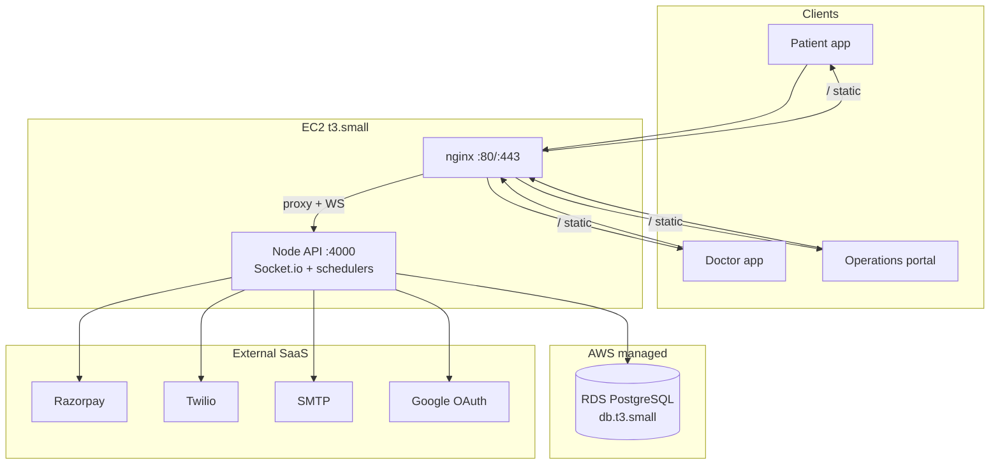

# AWS EC2 Infrastructure — HopeHub Clinic Platform

Sizing and deployment guide for **100–500 patients per day** (single clinic or small multi-branch).

## Summary

| Resource | Recommendation | Count |
|----------|----------------|-------|
| **EC2 (API + nginx)** | `t3.small` (2 vCPU, 2 GB) | **1** |
| **RDS PostgreSQL** | `db.t3.small` (2 vCPU, 2 GB), 20 GB gp3 | **1** |
| **ElastiCache Redis** | Not required at this scale | 0 |
| **Second API EC2** | Not required until HA / multi-instance | 0 |
| **Static hosting** | Same EC2 via nginx, or Netlify/S3 for patient app | optional CDN |

**Total EC2 to start: 1 instance** plus managed RDS.

Estimated monthly cost (ap-south-1, on-demand): **~₹4,500–7,000** (~$55–85) for EC2 + RDS + minimal data transfer.

---

## Traffic profile: 100–500 patients/day

| Metric | Low (100/day) | High (500/day) | Notes |
|--------|---------------|----------------|-------|
| Patients per clinic hour (10 h) | ~10/h | ~50/h | Assumes daytime clinic hours |
| Peak concurrent patients (app) | 5–15 | 25–50 | Booking, doses, chat, payments |
| Peak concurrent staff (ops portal) | 5–10 | 15–30 | Reception, store, admin |
| Active doctors + Socket.io | 2–5 | 8–15 | Consultations, realtime chat |
| API requests (est.) | ~3–5k/day | ~15–25k/day | ~20–50 calls per patient journey |
| Peak API throughput | ~5–10 req/s | ~20–40 req/s | Bursts during login / slot booking |
| Dose reminder sweep | Every 5 min, batch 200 | Same | Well within single-node capacity |
| Database size (1 year) | ~2–5 GB | ~5–15 GB | Without OOREP repertory import |

A single `t3.small` API node comfortably handles this load. CPU spikes from PDF generation and payment webhooks are short-lived.

### When to upgrade

| Trigger | Action |
|---------|--------|
| Sustained API CPU > 70% | Move to `t3.medium` |
| DB connections / slow queries | `db.t3.medium` or read replica |
| Need zero-downtime deploys | Second API instance + ALB + Redis |
| > 1,000 patients/day | Revisit architecture (see Scale-out) |

---

## Architecture



### Deployable units

| Artifact | Folder | Hosted on |
|----------|--------|-----------|
| API | `apps/api` | EC2 (Docker) |
| Patient web | `apps/user-web` | nginx or [Netlify](apps/user-web/netlify.toml) |
| Doctor web | `apps/doctor-web` | nginx or CDN |
| Operations (+ admin) | `apps/operations-web` | nginx or CDN |

`apps/admin-web` is compiled into operations-web — not deployed separately.

---

## EC2 instance specification

### Recommended: `t3.small`

| Spec | Value |
|------|-------|
| vCPU | 2 |
| RAM | 2 GB |
| Network | Up to 5 Gbps burst |
| Storage | 30 GB gp3 root volume |

**Runs on one box:** Docker (API container) + nginx serving 3 Angular builds.

### Alternative layouts

| Layout | EC2 | Best for |
|--------|-----|----------|
| **All-in-one** (recommended) | 1× `t3.small` | 100–500 patients/day, simplest ops |
| **API only** | 1× `t3.small` | Frontends on Netlify/S3 + CloudFront |
| **Comfort headroom** | 1× `t3.medium` | Heavy PDF use, many concurrent consultations |

---

## RDS PostgreSQL

| Setting | Value |
|---------|-------|
| Instance | `db.t3.small` |
| Engine | PostgreSQL 16 |
| Storage | 20 GB gp3 (auto-scale enabled) |
| Multi-AZ | Optional for launch; enable before go-live if budget allows |
| Backups | 7-day retention |
| `sslmode` | `require` (see `apps/api/.env.example`) |

Security group: allow **5432** only from the API EC2 security group.

---

## Security groups

| Group | Inbound |
|-------|---------|
| **ec2-web** | 80, 443 from `0.0.0.0/0`; 22 from your office IP only |
| **rds** | 5432 from `ec2-web` SG only |

---

## Domains and CORS

Set these in `deploy/.env` (from `deploy/.env.production.example`):

| Env var | Example |
|---------|---------|
| `API_PUBLIC_URL` | `https://api.hopehubcare.in` |
| `WEB_ORIGIN` | `https://patient.hopehubcare.in` |
| `DOCTOR_ORIGIN` | `https://doctor.hopehubcare.in` |
| `OPERATIONS_ORIGIN` | `https://ops.hopehubcare.in` |
| `ADMIN_ORIGIN` | `https://ops.hopehubcare.in` |

Update `apiUrl` in each app's `environment.prod.ts` before building static assets.

nginx server names are in `deploy/nginx/default.conf`.

---

## Deployment steps

### 1. Provision AWS

1. Launch **EC2** `t3.small` (Amazon Linux 2023 or Ubuntu 22.04), 30 GB gp3.
2. Create **RDS** `db.t3.small` PostgreSQL 16 in the same VPC.
3. Attach Elastic IP to EC2.
4. Point DNS A records: `api`, `patient`, `doctor`, `ops` → Elastic IP.

### 2. Bootstrap the host

```bash
git clone <repo-url> /opt/hopehub
cd /opt/hopehub
sudo bash deploy/scripts/bootstrap-ec2.sh all
# Log out and back in so docker group applies
```

### 3. Configure environment

```bash
cp deploy/.env.production.example deploy/.env
# Edit deploy/.env — DATABASE_URL, JWT_SECRET, origins, Razorpay, Twilio, SMTP
```

Set production API URLs in frontend env files, then deploy:

```bash
bash deploy/scripts/deploy.sh
```

`deploy.sh` builds Angular apps, runs Prisma migrations, and starts Docker Compose.

### 4. TLS (Let's Encrypt)

After DNS propagates:

```bash
sudo certbot certonly --webroot \
  -w /opt/hopehub/deploy/certbot/www \
  -d api.hopehubcare.in \
  -d patient.hopehubcare.in \
  -d doctor.hopehubcare.in \
  -d ops.hopehubcare.in
```

Add SSL server blocks to `deploy/nginx/default.conf` and reload nginx.

### 5. Production checklist

- [ ] `JWT_SECRET` is a strong random value
- [ ] `DISABLE_DEV_DEMO=true`
- [ ] Razorpay live keys + webhook URL → `https://api.<domain>/payments/razorpay-webhook` ([razorpay-setup.md](razorpay-setup.md))
- [ ] `GET /health` returns `ok: true` with database connected
- [ ] Socket.io works through nginx (`/socket.io/` upgrade headers)
- [ ] RDS automated backups enabled

---

## Repository deployment files

| File | Purpose |
|------|---------|
| `apps/api/Dockerfile` | Production API image |
| `deploy/docker-compose.prod.yml` | API + nginx stack |
| `deploy/nginx/default.conf` | Static SPAs + API/WebSocket proxy |
| `deploy/.env.production.example` | Environment template |
| `deploy/scripts/bootstrap-ec2.sh` | First-time host setup |
| `deploy/scripts/build-static.sh` | Build and stage Angular dist |
| `deploy/scripts/deploy.sh` | Full deploy (build, migrate, up) |
| `deploy/scripts/configure-production-urls.sh` | Inject API URLs before build |
| `deploy/scripts/build-android-release.sh` | Capacitor + signed AAB build |
| `deploy/scripts/install-google-services.sh` | Firebase config for Android CI |
| `deploy/.env.staging.example` | Staging environment template |
| `deploy/firebase/google-services.json.example` | Firebase file shape reference |
| `.github/workflows/deploy-cloud.yml` | Auto-deploy production (`main`) or staging (`staging`) |
| `.github/workflows/android-release.yml` | Android AAB build + optional Play Store upload |

### GitHub Actions setup

1. Create **Environments** in the repo: `production` and `staging`.
2. Add secrets to each environment (same names, different values per env):

| Secret | Purpose |
|--------|---------|
| `EC2_HOST`, `EC2_USER`, `EC2_SSH_KEY` | SSH deploy target |
| `API_PUBLIC_URL`, `WEB_ORIGIN`, `DOCTOR_ORIGIN`, `OPERATIONS_ORIGIN` | Frontend build URLs |
| `ANDROID_KEYSTORE_BASE64`, `ANDROID_KEYSTORE_PASSWORD`, `ANDROID_KEY_ALIAS`, `ANDROID_KEY_PASSWORD` | Android signing |
| `GOOGLE_SERVICES_JSON_USER_WEB`, `GOOGLE_SERVICES_JSON_DOCTOR_WEB`, `GOOGLE_SERVICES_JSON_OPERATIONS_WEB` | Firebase (base64 `google-services.json` per app) |
| `PLAY_STORE_JSON` | Google Play service account for auto-upload |

3. **Cloud deploy**: merge to `main` → production; merge to `staging` → staging EC2.
4. **Android**: Actions → Android Release → enable **Publish to Play** when ready (starts on `internal` track).

Firebase: create one Android app per package in [Firebase Console](https://console.firebase.google.com), download each `google-services.json`, then:

```bash
base64 -w0 google-services.json   # Linux
[Convert]::ToBase64String([IO.File]::ReadAllBytes("google-services.json"))  # PowerShell
```

Store each output as the matching GitHub secret.

---

## Single-instance constraints

The API today runs **one Node process** with:

- In-memory OTP store (`apps/api/src/services/otp.ts` — Redis needed for multi-instance)
- Socket.io without Redis adapter
- In-process schedulers (`apps/api/src/index.ts`)

For 100–500 patients/day, **one API instance is correct**. Do not add a second API EC2 until you add ElastiCache Redis and an ALB with sticky sessions.

---

## Scale-out path (> 500 patients/day)

1. **ElastiCache Redis** — shared OTP + Socket.io adapter
2. **ALB** — HTTPS termination, health checks on `/health`, sticky sessions for WebSocket
3. **2× API EC2** — `t3.small` behind ALB; run schedulers on one leader only
4. **CloudFront** — cache static Angular assets
5. **RDS read replica** — if reporting/analytics queries slow writes

---

## Monitoring (recommended)

| Check | Target |
|-------|--------|
| API health | `GET /health` — 200, `database: connected` |
| EC2 CPU | CloudWatch alarm > 80% for 15 min |
| RDS CPU / storage | CloudWatch free storage < 20% |
| Disk | Root volume < 80% full |

---

## Related docs

- [README.md](../README.md) — local dev and stack overview
- [consolidated-apps.md](consolidated-apps.md) — app map
- [razorpay-setup.md](razorpay-setup.md) — payment production checklist
