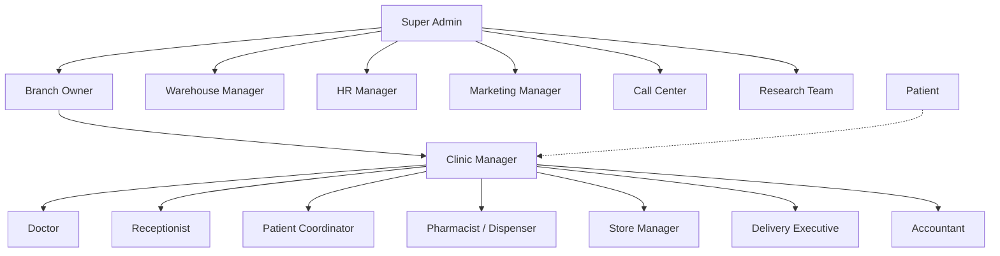

# Vitalis Platform — Digital Homeopathic Ecosystem

This document describes the full role and application landscape for a scalable digital homeopathic clinic chain: what exists today in this monorepo, what additional roles are worth building, and the recommended architecture for phasing delivery.

---

## Current state (this repository)

| App | Path | Port | Primary users | Status |
|-----|------|------|---------------|--------|
| **Patient** | `apps/user-web` | 4200 | Patients / families | Built |
| **Super Admin** | `apps/admin-web` | 4201 | Platform admin, finance, catalog | Built |
| **Doctor** | `apps/doctor-web` | 4202 | Consulting doctors | Built |
| **Store Staff** | `apps/store` | 4300 | Counter staff (PIN login) | Built |
| **Store Manager** | `apps/store-manager-web` | 4301 | Branch pharmacy managers | Built |
| **HR** | `apps/hr-web` | 4400 | HR / admin HR operations | Built |
| **API** | `apps/api` | 4000 | All apps | Built |

Shared backend: one PostgreSQL database, Prisma ORM, JWT auth (platform + store tokens), Socket.io, Razorpay, notifications.

**Already covered in current apps (partial or full):**

- Patient registration, OTP/password login, consultations, prescriptions, dose reminders
- Doctor consultations, prescribing, patient search, patient ID + QR scan
- Admin: doctors, consumers, diseases, stores, employees, leaves, payroll, finance
- Store staff: medicine search, stock in/out, QR patient scan, mark dose given
- Store manager: patients, medicines admin, staff activity, staff HR, expenses
- HR: store staff records, joining letters, leave workflows

---

## Organizational hierarchy

**Today’s mapping:** Super Admin ≈ `admin-web` + `hr-web`; Doctor ≈ `doctor-web`; Store Manager ≈ `store-manager-web`; Pharmacist/dispenser ≈ `store` (staff); Patient ≈ `user-web`. Branch Owner, Clinic Manager, Receptionist, and others are **not separate apps yet** — some capabilities live inside existing apps or are missing.

---

## Internal users — roles and apps

### Built or partially built

| Role | Dedicated app | Key workflows | Maps to today |
|------|---------------|---------------|---------------|
| **Super Admin** | Admin web | Platform config, doctors, consumers, finance, stores | `admin-web` |
| **Doctor** | Doctor web | Consult, prescribe, patient search, QR scan | `doctor-web` |
| **Store Manager** | Store manager web | Patients, inventory admin, staff HR, expenses | `store-manager-web` |
| **Pharmacist / dispenser** | Store staff web | Dispense, scan QR, stock in/out | `store` |
| **HR** | HR web | Employees, doctors HR, store staff, payroll, leaves | `hr-web` |
| **Patient** | Patient web | Book care, reminders, profile, ID card | `user-web` |

### Recommended additional internal apps

| Role | App name | Key workflows | Priority notes |
|------|----------|---------------|----------------|
| **Receptionist** | Receptionist app | Register patients, book appointments, walk-ins, queue | High — front desk is daily bottleneck |
| **Patient coordinator** | Coordinator app | Follow-up reminders, treatment plans, missed appointments | Medium — extends adherence story |
| **Inventory manager** | Inventory app | Stock transfers, purchase requests, expiry (beyond branch store) | Medium — overlaps store manager until multi-branch warehouse |
| **Clinic manager** | Clinic manager app | Staff attendance, revenue, doctor schedules, branch KPIs | High — sits between branch owner and floor staff |
| **Accountant** | Accountant app | Billing, expenses, payroll, GST reports | Medium — partial in `admin-web` finance |
| **Delivery executive** | Delivery app | Home medicine delivery, tracking, OTP proof | Medium — if home delivery is offered |
| **Call center** | Call center app | Inbound/outbound, leads, follow-up | Lower — can start as admin module |
| **Marketing** | Marketing app | Campaigns, referrals, lead analytics | Lower — phase 2 growth |
| **Warehouse manager** | Warehouse app | Central inventory, branch distribution | Lower — multi-branch scale |
| **Research & analytics** | Analytics app | Disease trends, medicine effectiveness, outcomes | Lower — needs data volume |

---

## External users — portals

| Portal | Key workflows | Integration |
|--------|---------------|-------------|
| **Supplier** | Purchase orders, shipment status, invoices | Links to inventory / procurement API |
| **Diagnostic center** | Upload reports, link to patient record | Links to patient chart + consultations |
| **Corporate wellness** | Employee health, company billing | B2B contracts per company |
| **Insurance** (optional) | Claims, documentation | Region-specific; later phase |

These are typically **separate lightweight portals** (or supplier/diagnostic subdomains), not full clinic apps.

---

## Recommended 11 core apps (MVP chain)

For a complete but focused digital homeopathic chain, ship these **11** first:

| # | App | Audience | Replaces / extends |
|---|-----|----------|-------------------|
| 1 | **Super Admin** | Platform operators | `admin-web` ✓ |
| 2 | **Branch Owner** | Franchise / branch P&L owners | New — dashboard over branches |
| 3 | **Clinic Manager** | Day-to-day branch operations | New — reception + ops hub |
| 4 | **Doctor** | Clinicians | `doctor-web` ✓ |
| 5 | **Receptionist** | Front desk | New — or Clinic Manager module |
| 6 | **Patient** | Consumers | `user-web` ✓ |
| 7 | **Pharmacy / Store Manager** | Branch pharmacy leadership | `store-manager-web` ✓ |
| 8 | **Store Staff (dispenser)** | Counter dispensing | `store` ✓ |
| 9 | **Delivery Executive** | Last-mile medicines | New |
| 10 | **Accountant** | Finance & compliance | New — or expand `admin-web` |
| 11 | **Supplier portal** | Vendors | New external portal |

**Optional 12th:** Diagnostic center portal when lab partnerships are live.

`hr-web` remains a **platform HR console** (recruitment, attendance, leave, performance) used by Super Admin / HR Manager rather than a separate “core clinic floor” app.

---

## Role → app matrix (full vision)

| Role | App | Internal / external |
|------|-----|---------------------|
| Super Admin | Admin web | Internal |
| Branch Owner | Branch owner web | Internal |
| Clinic Manager | Clinic manager web | Internal |
| Doctor | Doctor web | Internal |
| Receptionist | Receptionist web | Internal |
| Patient Coordinator | Coordinator web | Internal |
| Pharmacist / dispenser | Store staff web | Internal |
| Store Manager | Store manager web | Internal |
| Inventory Manager | Inventory web | Internal |
| Accountant | Accountant web | Internal |
| Delivery Executive | Delivery web | Internal |
| Call Center | Call center web | Internal |
| Marketing | Marketing web | Internal |
| Warehouse Manager | Warehouse web | Internal |
| HR Manager | HR web | Internal |
| Research & Analytics | Analytics web | Internal |
| Patient | Patient web | External-facing |
| Supplier | Supplier portal | External |
| Diagnostic center | Diagnostic portal | External |
| Corporate wellness | Corporate portal | External |
| Insurance | Insurance portal | External |

---

## Suggested phasing

### Phase 1 — Operational clinic (current + tighten)

- Patient, Doctor, Admin, Store Staff, Store Manager, HR, API
- Patient ID + QR, family mobile login, dose tracking
- Launch checklist: see `docs/launch-priority-roadmap.md`

### Phase 2 — Front desk and branch ops

- **Receptionist app** (or Clinic Manager v1): appointments, walk-in queue, patient registration at desk
- **Clinic Manager app**: schedules, branch dashboard, staff attendance view
- Consolidate duplicate flows (register patient: reception vs store vs doctor)

### Phase 3 — Money and supply chain

- **Accountant app** (or admin finance modules): GST, payroll exports, branch P&L
- **Supplier portal**: POs and GRN linked to store inventory
- **Warehouse / inventory manager** when multiple branches share central stock

### Phase 4 — Growth and ecosystem

- Delivery executive app
- Diagnostic center portal
- Marketing / call center / corporate wellness
- Research & analytics on aggregated (de-identified) outcomes

---

## Technical conventions (new apps)

When adding a new app to this monorepo:

1. **Path:** `apps/<role>-web` (e.g. `apps/receptionist-web`)
2. **Port:** next free in the 42xx–44xx range; register in `apps/api/.env.example` as `<APP>_ORIGIN`
3. **CORS:** add origin to `SERVER_CONFIG.ORIGINS` and `apps/api/src/index.ts`
4. **Auth:** reuse API JWT patterns — platform users (`Role` in Prisma) vs store staff JWT vs future role-specific tokens
5. **Scripts:** add `dev:<app>` and `build:<app>` to root `package.json` and include in `build:all`

### Port map (today)

| Service | Port |
|---------|------|
| API | 4000 |
| Patient (`user-web`) | 4200 |
| Admin | 4201 |
| Doctor | 4202 |
| Store staff | 4300 |
| Store manager | 4301 |
| HR | 4400 |
| *Reserved for new apps* | 4203+, 4302+, 4401+ |

---

## How this doc relates to other docs

| Document | Purpose |
|----------|---------|
| `README.md` | Setup and run instructions |
| `docs/launch-priority-roadmap.md` | Pre-launch must-haves for current apps |
| `docs/2-week-implementation-plan.md` | Short-term execution plan |
| **This doc** | Long-term role/app architecture and phasing |

---

## Summary

A full digital homeopathic ecosystem spans **internal clinic staff** (reception through pharmacy and finance), **platform operators** (admin, HR, warehouse), and **external partners** (suppliers, labs, corporates). This repository already implements the **core clinical and pharmacy loop** for six user-facing apps plus API. The recommended **11-app MVP** adds Branch Owner, Clinic Manager, Receptionist, Delivery, Accountant, and Supplier portal while keeping the apps already built. Additional roles (coordinator, marketing, call center, research) layer on once daily operations and multi-branch scale justify them.
